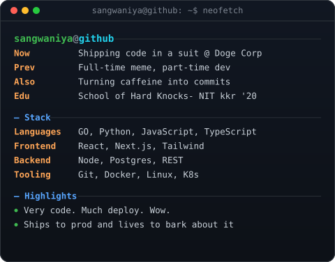

<!--
  This is your PROFILE README. It lives in a repo named exactly after your
  username (github.com/Sangwaniya/Sangwaniya) so GitHub shows it on your profile.
  The name/tagline and the three badge links below are PLACEHOLDERS -- edit them
  with your real info anytime. Widths 370/490 keep the portrait and info card the
  same height; if you change the info card's H, re-match these.
-->

<table>
<tr>
<td valign="top"></td>
<td valign="top"></td>
</tr>
</table>

## Sangwaniya

**Developer · Meme Enthusiast · Ships Code in a Suit**

 

<!-- animated contribution graph, refreshed daily by the workflow -->

